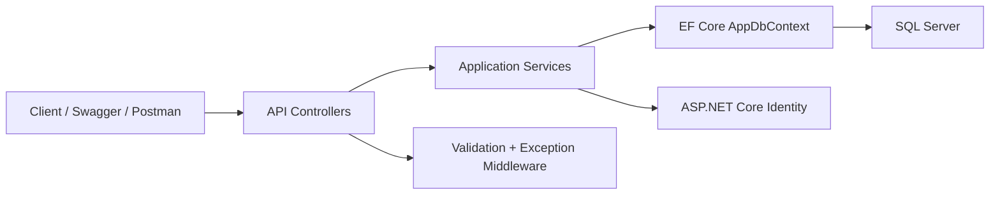

# ClinicFlow

ClinicFlow is a portfolio-grade Smart Clinic Management System API built with .NET 9, ASP.NET Core Web API, Entity Framework Core, SQL Server, ASP.NET Core Identity, JWT authentication, Serilog, and Swagger.

The project models realistic clinic workflows: doctors, patients, schedules, appointments, visits, prescriptions, dashboard reporting, audit fields, soft delete, role-based authorization, validation, and automated tests.

## Highlights

- Clean Controller-Service-DbContext architecture
- ASP.NET Core Identity with JWT bearer authentication
- Refresh token rotation with hashed token storage
- Role-based access control: Admin, Doctor, Receptionist
- Strong appointment business rules and database conflict protection
- Soft delete with audit fields and query filters
- Unified API response shape
- Global exception middleware
- Health checks, rate limiting, response caching, Swagger, Serilog
- Unit and integration tests with xUnit and WebApplicationFactory
- Docker Compose support with SQL Server
- GitHub Actions CI workflow
- Postman collection included
- Backward-compatible API routes under `/api/...` and `/api/v1/...`

## Tech Stack

- .NET 9
- ASP.NET Core Web API
- Entity Framework Core 9
- SQL Server / SQL Server LocalDB
- ASP.NET Core Identity
- JWT Bearer Authentication
- Serilog
- Swagger / OpenAPI
- xUnit
- Docker Compose

## Architecture

ClinicFlow uses a pragmatic layered structure suitable for a portfolio backend:

```text
HTTP Request
  -> Controller
  -> Service
  -> AppDbContext
  -> SQL Server
```



## Modules

- Auth
- Doctors
- Patients
- Specializations
- Doctor Schedules
- Appointments
- Visits
- Prescriptions
- Dashboard

## Roles and Permissions

| Role | Typical Access |
|---|---|
| Admin | Full management, dashboard, users, doctors, schedules, delete operations |
| Receptionist | Patients and appointments workflow |
| Doctor | Own appointments, visits, prescriptions, and clinical workflow |

## Important Business Rules

Appointments:

- Appointment date must be in the future.
- Appointment time cannot include seconds or milliseconds.
- Appointment time must align to a 15-minute boundary.
- Appointment must be inside the doctor's working schedule.
- A doctor cannot have two active appointments at the same time.
- A patient cannot have two active appointments at the same time.
- Cancelled appointments can free the time slot.
- Database unique indexes protect against race-condition conflicts.

Deletion and soft delete:

- Doctors, patients, and specializations use soft delete.
- Query filters hide soft-deleted data from normal reads.
- Doctors cannot be deleted if linked schedules or appointments exist.
- Patients cannot be deleted if linked appointments exist.
- Visits cannot be deleted if linked prescriptions exist.
- Specializations cannot be deleted if linked doctors exist.

Clinical workflow:

- Visits cannot be created for cancelled or pending appointments.
- Visits cannot be created before the appointment time.
- Prescriptions must be linked to an existing visit.

## Project Structure

```text
ClinicFlow/
  Common/
  Constants/
  Controllers/
  Data/
    Seed/
  DTOs/
  Entities/
  Enums/
  Extensions/
  Interfaces/
  Middlewares/
  Migrations/
  Services/
  Program.cs
  appsettings.json

ClinicFlow.Tests/
  TestSupport/
  AppointmentServiceTests.cs
  ApiIntegrationTests.cs
  AuthIntegrationTests.cs
  VisitServiceTests.cs

.github/workflows/ci.yml
docs/
Dockerfile
docker-compose.yml
postman/ClinicFlow.postman_collection.json
```

## Getting Started

### Prerequisites

- .NET 9 SDK
- SQL Server LocalDB, SQL Server Developer, or Docker
- Optional: Docker Desktop

### Run Locally with LocalDB

From the repository root:

```powershell
dotnet restore "progect 2.sln"
dotnet build "progect 2.sln"
```

Configure development secrets:

```powershell
cd ClinicFlow
dotnet user-secrets set "Jwt:Key" "ClinicFlow_Development_Jwt_Key_Change_Me_1234567890"
dotnet user-secrets set "AdminSeed:Enabled" "true"
dotnet user-secrets set "AdminSeed:FullName" "ClinicFlow Admin"
dotnet user-secrets set "AdminSeed:Email" "admin@clinicflow.local"
dotnet user-secrets set "AdminSeed:Password" "Admin@12345"
dotnet user-secrets set "DemoSeed:Enabled" "true"
```

Apply migrations and run:

```powershell
dotnet ef database update
dotnet run
```

Swagger is available in Development at:

```text
https://localhost:7093/swagger
http://localhost:5173/swagger
```

### Run with Docker Compose

Create a local `.env` from the sample:

```powershell
copy .env.example .env
```

Then run:

```powershell
docker compose up --build
```

The API will be available at:

```text
http://localhost:8080
http://localhost:8080/swagger
```

Default demo admin from `.env.example`:

```text
Email: admin@clinicflow.local
Password: Admin@12345
```

## Testing

Run all tests:

```powershell
dotnet test "progect 2.sln"
```

Current coverage includes:

- Appointment business rules
- Soft delete behavior
- SQLite-backed integration tests for relational constraints
- Doctor-scoped appointment visibility
- Visit creation rules
- API endpoint authorization
- Auth login/register/refresh/revoke integration tests
- Health/root endpoint checks
- `/api/v1` route compatibility

## CI

GitHub Actions workflow:

```text
.github/workflows/ci.yml
```

The pipeline runs:

- restore
- build
- tests
- format check

## Postman

Import this collection:

```text
postman/ClinicFlow.postman_collection.json
```

Set `baseUrl`, run `Auth - Login`, then use the authenticated requests.

## Configuration

Important settings:

| Key | Description |
|---|---|
| `ConnectionStrings:DefaultConnection` | SQL Server connection string |
| `Jwt:Key` | JWT signing key, minimum 32 characters |
| `Jwt:Issuer` | Token issuer |
| `Jwt:Audience` | Token audience |
| `Jwt:DurationInMinutes` | Token lifetime |
| `Jwt:RefreshTokenDurationInDays` | Refresh token lifetime |
| `AdminSeed:*` | Optional development admin seed |
| `DemoSeed:Enabled` | Optional development demo data |

Security notes:

- Never commit production secrets.
- The default JWT placeholder is blocked outside Development and Testing.
- Startup migrations and seed data run only in Development.
- Production deployments should apply migrations explicitly through CI/CD or an operator command.

## Useful Commands

```powershell
dotnet restore "progect 2.sln"
dotnet build "progect 2.sln" --no-restore
dotnet test "progect 2.sln" --no-build --no-restore
dotnet format "progect 2.sln" --verify-no-changes --no-restore
dotnet ef database update --project "ClinicFlow/ClinicFlow.csproj"
docker compose up --build
```

## API Examples

Login:

```http
POST /api/auth/login
Content-Type: application/json

{
  "email": "admin@clinicflow.local",
  "password": "Admin@12345"
}
```

Refresh token:

```http
POST /api/auth/refresh
Content-Type: application/json

{
  "userId": "{userId-from-login}",
  "refreshToken": "{refreshToken-from-login}"
}
```

Create an appointment:

```http
POST /api/appointments
Authorization: Bearer {token}
Content-Type: application/json

{
  "doctorId": 1,
  "patientId": 1,
  "appointmentDate": "2026-06-01T09:00:00"
}
```

Create a visit:

```http
POST /api/visits
Authorization: Bearer {token}
Content-Type: application/json

{
  "appointmentId": 1,
  "symptoms": "Headache and fatigue",
  "diagnosis": "Migraine",
  "notes": "Patient advised to rest and hydrate."
}
```

## Portfolio Notes

This project is intentionally practical rather than over-engineered. It keeps a clear service layer, strong validation, EF Core constraints, and integration tests while avoiding unnecessary architectural ceremony. It is designed to be easy for a reviewer to run, inspect, and discuss in an interview.
